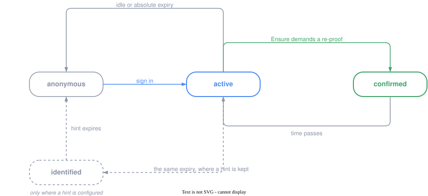

`auth.mode` には3つの値があります。名前だけ見れば、ログインの方法を選んでいるように読めます。OIDC でログインするのか、パスキーでログインするのか、その両方か。

ところが `oidc_passkey` の日常のログインはパスキーで、プロバイダは復旧のときにしか出てきません。`oidc_only` と `oidc_passkey` は「OIDC を使うかどうか」で分かれていない。分かれているのは別のところです。

## モードが分けているもの

パスキーはアカウントを作れません。作れない理由は単純で、最初のクレデンシャルを結びつける先が無いからです。公開鍵を受け取っても、それが誰のものかを言えるものが他に無ければ、サービス側にできることはありません。

つまり、どのモードも「誰かがログインする前に、そのアカウントを何が存在させたか」という問いに答える必要があります。3つのモードはその答えです。

| `auth.mode` | アカウントの出どころ | 日常のログイン | 復旧の権威 |
| --- | --- | --- | --- |
| `oidc_only` | プロバイダ | プロバイダ | プロバイダ |
| `oidc_passkey` | プロバイダ | パスキー | プロバイダ |
| `passkey_only` | 管理者が発行するログイン ID と使い捨てシークレット | パスキー | 管理者、または別のパスキー |

右端の列が、実運用でいちばん重い列です。

### `oidc_only`

プロバイダに寄せきる構成です。アカウントの作成も、日常のログインも、パスワードを忘れた人の救済も、全部あちらで起きます。こちらが持つのはセッションだけ。

**得られるもの。** 保管すべきクレデンシャルがありません。漏洩する対象が無いので、漏洩対策も要りません。退職や解約でプロバイダ側のアカウントが止まれば、こちらのログインも自動的に止まります。B2B ではこれが決定的な価値になります。

**引き受けるもの。** プロバイダが落ちればログインも落ちます。プロバイダのポリシーがそのまま自社のポリシーになります。そして、そのプロバイダにアカウントを持たない人は、どうやっても入れません。

### `oidc_passkey`

初回だけプロバイダを通り、以後はパスキーで入ります。プロバイダは日常の導線から外れて、復旧手段として後ろに控えます。

**得られるもの。** ログインが速くなります。プロバイダへの往復が消えるので、ネットワークもプロバイダの可用性も日常の経路から外れます。それでいて、パスキーを失った人には `oidc_only` と同じ救済路が残っている。

**引き受けるもの。** 認証方法が2つある状態を、設計として意識し続ける必要があります。どちらが強いのか、片方を消せるのは誰なのか、両方失った人はどうなるのか。`auth.recovery.policy` を明示的に決めるまで起動しないのは、この問いを黙って先送りさせないためです。

### `passkey_only`

プロバイダが存在しません。アカウントは管理者が作り、ログイン ID と使い捨てシークレットを本人に渡します。本人はそれを引き換えて、自分のパスキーを登録します。

**得られるもの。** 外部依存がゼロになります。共有秘密も保管しません。閉じたネットワークや、IdP を持たない組織でも成立します。

**引き受けるもの。** 復旧が全部こちらの仕事になります。「メールアドレスを知っていること」は復旧の根拠になりません（それは誰でも知りうるので、既定で禁止しています）。使えるのは、別のパスキー、管理者による再発行、あるいはアプリケーションが自前で用意した検証済みの手段だけです。

## どれを選ぶか

モード単体ではなく、admission（誰を通すか）と組み合わせて決まります。

### B2C

利用者は Google や Apple のアカウントを持ってやってきます。`oidc_only` か `oidc_passkey`、admission は `authenticated` に `auto_provision = true`。誰でも、初回ログインでアカウントができます。

考えておくべきことが1つあります。利用者がその Google アカウントを失ったとき、あなたのサービスからも同時に締め出されるということです。`oidc_passkey` にしてパスキーを登録させておけば、そこが二重化されます。

### B2B

導入先企業の IdP が権威です。`oidc_only` に admission `registered` を組み合わせて、**ログインより先に**入れる人を登録しておきます。従業員番号のような、ディレクトリ側が発行する安定した識別子を `auth.oidc.identity_claim` に指定できるので、まだ一度もログインしていない人を先に登録できます。

退職処理は先方の IdP で起きます。そこでアカウントが止まれば、こちらのログインも止まる。こちら側に退職者リストを持たなくて済むことが、この構成の実利です。

### 共有端末

受付、工場のライン、店舗の端末。ブラウザが人と1対1に対応しません。

`auth.shared_device = true` を立てます。これは3つの設定を束ねたもので、**どれか1つだけでは効果がありません**。ローカルの記憶を消しても、IdP のセッションが生きていれば、次の人はプロバイダのアカウント選択画面で前の人の名前を見ます。名前を出しているのは IdP の方だからです。

そして共用端末で一番多いのは、明示的なサインアウトではなく放置です。`auth.assurance.presence` を併せて有効にしてください。詳しくは後述します。

### 閉じた社内システム

IdP がない、あるいは外部に出せない。`passkey_only` に admission `registered`、`auth.registration.policy = "administrator"`。管理者が発行したブートストラップ資格情報が、そのままアカウント開設の儀式になります。

## ログインが終わったあと

ここまではログインの話でした。ログインが終わったあと、セッションは有効か無効かの2状態しか持っていない、というのが素朴な設計です。

その設計には問題があります。盗まれたセッションクッキーが、決済にも、クレデンシャル変更にも、エクスポートにも、**フル権限で届いてしまう**。パスキーや MFA でログインの瞬間を固めるほど、攻撃者は認証を突破するのをやめて、認証後のクッキーを盗む方に移ります。実際、2025年以降のアカウント乗っ取りの主流はそちらです。

対策として有効期限を短くすると、今度は普通の利用者が何度もログインさせられます。ログインを稀にするダイヤルと、盗難の被害範囲を絞るダイヤルが、同じ1本のつまみになっている。これが2状態モデルの限界です。

### 状態と遷移

セッションが取りうる状態は4つですが、一直線には並びません。ログインで `active` に入り、重い操作の前に `confirmed` へ上がり、時間が経つと下がっていく。循環します。



`identified` を破線にしてあるのは、既定ではこの状態が存在しないからです。ヒントを設定していなければ `active` から `anonymous` へ直行します。前回の記憶を残すかどうかは明示的に有効にする設定で、共有端末では禁止されます。

このうち **ハンドラが分岐するのは2つだけ** です。

- 認証済みかどうか → `auth.protection.include` に書くだけで、ハンドラのコードは1行も要りません
- 最近証明したかどうか → 操作ごとにハンドラで宣言します

`identified`（前回の記憶）は、ログイン画面の見た目の話であって、ハンドラが分岐する対象ではありません。`anonymous` はログインの問題で、パスの保護が先に答えます。

### 軸は鮮度だけ

「最近証明したか」の他に「どれくらい強い方法で証明したか」という軸を置くこともできます。置いていません。

フレームワークがログイン方法に順序を付けられないからです。`oidc_only` と `passkey_only` はそれぞれ1つの方法しか生まないので、順序を付ける対象がありません。`oidc_passkey` は2つ生みますが、どちらが強いかは一般には決まらない。ハードウェアキーを使う IdP はローカルのパスキーより強く、ユーザー検証なしのパスキーは90日 SSO セッションを通す IdP より強い。順序はデプロイがそのプロバイダについて主張することであって、ラベルの性質ではありません。

そういうわけで、ハンドラが書くのは1つの述語と1つのパラメータだけです。

```go
app.HandleFunc("GET /admin", auth.Ensure(adminPage, auth.Policy("admin")))
app.HandleFunc("POST /api/admin/drop", auth.EnsureAPI(drop, auth.Policy("danger")))
```

```toml
[[auth.assurance.policy]]
name = "admin"
max_age = "15m"

[[auth.assurance.policy]]
name = "danger"
max_age = "0"
confirm = true    # この操作のために、いま確認しろ
```

名前で引くようにしてあるのは、同じハンドラのコードが、窓の広い B2C デプロイと窓の狭い社内デプロイの両方で動くようにするためです。

### ログインは確認の代わりにならない

ここまでの窓は「最後に証明してから何分か」を見ています。すると、ログイン直後のセッションは**あらゆる窓を最初から満たしています**。ダッシュボードを見るためにサインインした人が、そのまま送金画面まで一度も問われずに到達する。

サインインと、ある操作の確認は、別の行為です。ログインはその人自身の都合で起きたことで、**いま送金しようとしている人について何も言っていません**。ステップアップはこの操作が要求したから起きた。鮮度だけで見ると、この2つが同じものになります。

そこで要求は2種類あります。

```go
auth.MaxAge(15 * time.Minute)     // 直近の証明なら何でもよい。ログインも数える
auth.Confirmed(5 * time.Minute)   // このガードが要求した再証明のみ。ログインは数えない
```

```toml
[[auth.assurance.policy]]
name = "transfer"
max_age = "5m"
confirm = true    # ログインでは満たされない
```

管理画面に入るだけなら `MaxAge` で足ります ── 午後ずっと開きっぱなしのセッションを弾きたいのであって、たった今サインインした人を疑いたいわけではないからです。送金、テナント削除、顧客リストのエクスポートには `Confirmed` を使います。

`Confirmed(0)` は「この操作のために、いま確認しろ」です。ゼロは経過時間では決して満たされません。プロバイダへの往復が必ず0秒より長くかかるので、時刻の比較で判定すると再証明の直後にもう一度弾いて永久に収束しない。完了したステップアップが残す通行許可だけがこれを満たします。窓を正の値にすると、1回の確認で数分ぶんの操作をまとめて通せます。

### 測る起点

鮮度をどこから測るか。到着時刻ではありません。

IdP は `max_age` を受け取っても、自分の SSO セッションからそれを満たして返すことがあります。返ってきたトークンが「たった今届いた」ことは、「たった今認証した」ことを意味しない。`auth_time` クレームが本当の証明時刻で、鮮度はそこから測ります。

だから `max_age` を送ったのに `auth_time` が返らなければ、それは再証明の失敗として扱います。OpenID Connect は `max_age` を送った場合に `auth_time` を必須にしているので、無いということはプロバイダが問いに答えなかったということです。

`prompt=login` の方は検証できません。仕様上は SHOULD で、しかも「従いました」と報告するクレームが存在しない。だから `prompt` は対話を増やす助けであって、証明にはなりません。**セキュリティ判断は `max_age` と `auth_time` に載せます。**

## シーケンス

### 通常のログイン

```
ブラウザ            Popcorn Wave              IdP
   │  GET /auth/login   │                      │
   ├───────────────────►│                      │
   │                    │ nonce と PKCE を生成  │
   │ 302 ───────────────┤                      │
   ├───────────────────────────────────────────►│
   │                    │            認証・同意 │
   │◄───────────────────────────────────────────┤
   │  GET /auth/callback?code=…                 │
   ├───────────────────►│                      │
   │                    │ code を交換           │
   │                    ├─────────────────────►│
   │                    │◄─────────────────────┤
   │                    │ ID Token を検証       │
   │                    │ admission を評価      │
   │                    │ セッションをローテート │
   │◄───────────────────┤                      │
```

最後のローテートは、ブラウザが持っていたセッションを必ず失効させます。ログイン前のセッションが生き残らないので、固定化攻撃が成立しません。

### ステップアップ

```
ブラウザ            Popcorn Wave              IdP
   │  GET /payment      │                      │
   ├───────────────────►│                      │
   │                    │ auth_time が古い       │
   │  302 /auth/login?max_age=1800&next=/payment │
   │◄───────────────────┤                      │
   │  ────────────────────────────────────────►│  max_age + prompt=login
   │                    │            再認証     │
   │◄───────────────────────────────────────────┤
   │  GET /auth/callback │                      │
   ├───────────────────►│                      │
   │                    │ ① 同一アカウント検査   │
   │                    │ ② auth_time を検証     │
   │                    │ ③ admission を再評価   │
   │                    │ ④ ローテート           │
   │  302 /payment ─────┤                      │
   │◄───────────────────┤                      │
```

①が抜けると、ステップアップは**アカウントのすり替え**になります。前のアカウントの機微な操作がステージされたまま、別人のログインでそれが通ってしまう。issuer と識別クレームと値を、いま持っているセッションと突き合わせて、一致しなければ何も書かずに失敗します。

③があるのは、その間に権限を失った人が再証明で復活しないようにするためです。

POST の再開には限界があります。コールバックからの戻りはリダイレクト、つまり GET なので、フレームワークが自動で再現できるのは安全なメソッドだけです。だから読み取り側に実効的な窓を、書き込み側は境界として置き、書き込み側の窓を少し緩くします。フォームを長く書いている間に読み取り側の証明が切れて、送信で入力を失うのを避けるためです。

### ログアウト

ログアウトが IdP に対して何をするかは、3通りありえます。うち1つは採用していません。

```
local      ローカルのみ破棄。IdP は触らない
           → 次のログインが無言で通る。サインアウトが効いていないように見える
           → 採用しない

reconfirm  ローカルを破棄し、IdP には何も送らない（既定）
           → 次の認可に prompt=select_account login を積む
           → IdP のセッションは生きたまま。他の RP は影響を受けない

global     end_session_endpoint を叩く
           → IdP のセッションも終わる。共有している全アプリからサインアウト
```

`reconfirm` は名前を付けただけで、規格ではありません。ログアウト時に**プロバイダへ送るリクエストは存在しません**。次の普通の認可リクエストにパラメータを1つ足すだけです。

そもそも「自分の RP の分だけ IdP から忘れてもらう」という手段は仕様に存在しません。OP のセッションは RP 横断で共有される1つのもので、RP-Initiated Logout は全部消すか何もしないかの二択です。`reconfirm` は OP に何も頼まないことでこれを回避します。

`global` を選ぶのは、共有端末、キオスク、そして「サインアウトとは全部から出ることだ」と定義しているデプロイです。利用者に両方を出したいなら `auth.oidc.allow_global_logout_request` を立てます。リクエストからは**昇格だけ**でき、降格はできません。

### 放置されたセッション

アイドルタイムアウトは、最後の**リクエスト**からの時間を測っています。人からの時間ではありません。

この差が実害になる場面があります。ライブ接続を持つページは自分で再接続を繰り返すので、誰も居なくてもセッションが延び続けます。逆に、1つのページを40分読んでいる人はリクエストを出さないので、作業中に切れます。

`auth.assurance.presence` を有効にすると、ブラウザが**1ティックあたり1ビット**を報告します。前回から入力イベントがあったかどうか、それだけです。座標も打鍵内容も間隔もブラウザから出ません。

信頼の向きは対称ではありません。

- 「離席した」という報告は**そのまま採用します**。誤検知のコストはログイン1回です
- 「まだ居る」という報告は**サーバの境界内でのみ有効です**。スクリプトから偽装できるので、絶対期限は動かせません
- ビーコンが**届かないこと自体が離席の報告です**。クライアントは「そこに居ない」を能動的に主張できません

スリープ復帰を直接知る API はありません。一定間隔で発火するはずのタイマーが大きく飛んだことから推定し、それは在席ではなく離席として扱います。

## 前回の記憶を残すか

セッションが切れたあと、ブラウザに「前回サインインしたのは誰か」を残せます。既定では残しません。

残す価値があるのは、**プロトコルが供給できない情報**があるからです。IdP は `prompt=select_account` で「自分のところのどのアカウントか」を教えられますが、そのデプロイが他にどんな IdP を並べているかは知りません。複数の IdP に対応している画面が毎回ピッカーを出すか出さないかは、ローカルの記憶にしか決められません。パスキー専用構成には、そもそも尋ねる相手がいません。

残す場合、封緘クッキーに入るのでブラウザからは読めません。だからログイン ID を入れられます。守るべきなのは中身ではなく、**ログイン画面に描画したもの**の方です。共有端末で次に座る人が読むのはそちらなので、`auth.MaskIdentifier` を通します。

issuer はマスクできません。「Microsoft で続ける」ボタンを出すか出さないかの二択で、部分的な形がない。だから issuer を覚えてよいかどうかは表示の工夫ではなく、有効にするかどうかと寿命の設定です。`ttl = "0"` は正当な答えで、そのときブラウザは `active` から `anonymous` へ直行します。

## 次に読むもの

設定キーの一覧、エンドポイントの仕様、パスキーの儀式、セッションのバックエンド選択は [認証](/ja/guides/backend/authentication/) にあります。セッションの保存先そのものについては [セッション](/ja/guides/backend/sessions/) を参照してください。
