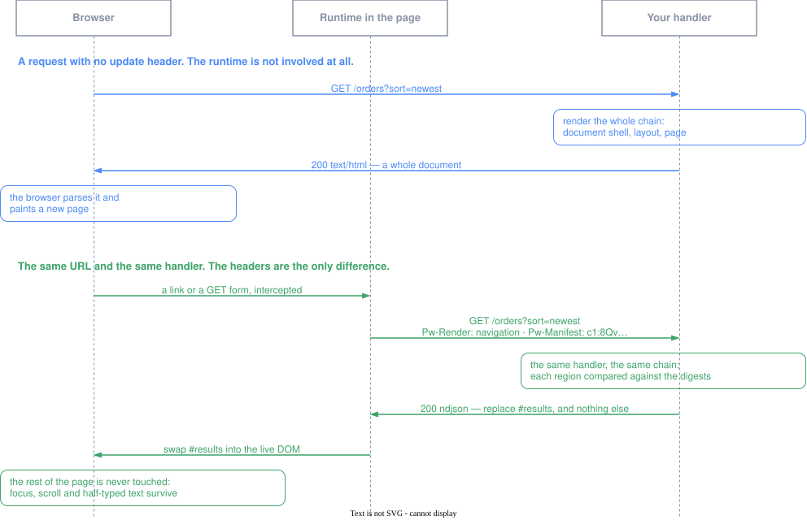

検索ページはリクエストの関数です。並び順を変えるとサーバはレイアウトも、ナビ
ゲーションも、フッタも、そして結果一覧も描画します。ブラウザはそのうち4つを
捨てて、動いた1つだけを描きます。残りは最初から持っていたのに。

部分更新はこの落差を埋めます。同じ URL が、完全なドキュメントを求める相手には
それを返し、レイアウトをすでに持っているページには、マークアップが実際に変わった
領域だけを返します。

`popcornwave.toml` で有効にします。

```toml
[html]
[html.update]
enabled = true
validator_key = "${HTML_UPDATE_VALIDATOR_KEY}"
```

既定でオフなのは、リロードで十分なページには要らないからです。そして無料でも
ありません。ドキュメントごとにブラウザランタイムが1本増え、配布する秘密が1つ
増え、再描画は副作用を持ってはいけないという規則が加わります。リロードそのものが
目につくほど頻繁に更新される画面から検討してください。

## サーバが送るものと、誰が当てるか

違いは「小さいほうの応答」ではありません。**返ってくるものの種類が違い、それを
ページにするものも違います**。



まず青を読んでください。更新ヘッダのないリクエストで、どのクライアントでも通れる
唯一の道です。返るのは**ドキュメント**で、ページを置き換えるのはブラウザ自身の
パーサです。JavaScript は関与しません。ランタイムのライフラインに何も触れていないのは
そのためです。

緑は同じ URL、同じハンドラです。変わったのはヘッダで、返ってくるのはページではなく
**指示**です。領域が1つ名指され、その新しいマークアップが添えられ、レイアウトにも
ナビゲーションにもフッタにも何も言及がありません。それらのダイジェストは、リクエストが
すでに持っていたものと一致したからです。

最後の部分がランタイムの仕事です。名指された領域を、いま画面に出ている DOM に
差し込みます。だから周りはそのまま残ります。フォーカスも、スクロール位置も、開いた
ままのドロップダウンも、入力途中の文字も。ドキュメントを解析し直したら、どれも
残りませんでした。

再描画は、この緑をルート全体ではなくコンポーネント1つに向けたものです。リクエストは
`Pw-Kind` と `Pw-Instance` でそれを名指し、応答はそのコンポーネントのマークアップ
だけで包みがありません。だからこのエンドポイントは `curl` で読めます。

どれも退避の仕方は同じです。ランタイムが無ければ、プロキシがヘッダを落としていれば、
あるいはどこかで何かが狂えば、それは普通のナビゲーションになり、答えは青の道です。

## ページ側は何も変わらない

描画されるチェーンのレイアウトとページは、すでに更新の境界です。`.pw.html` の
チェーンは `_pw_gen.go` にコンパイルされ、各境界のルート要素には識別子が、
描画結果にはダイジェストが載ります。古いダイジェストを携えて届いたリクエストには
差分で答えられる、というのはそういう意味です。

だからハンドラは変わりません。テンプレートも変わりません。何も要求しない
リクエストは、いままでと同じバイト列を受け取ります。クローラも、`curl` も、
スクリプトを走らせないブラウザも、ここまでの話に影響されません。

普通のコンポーネントは意図的に境界**ではありません**。500行のリストが境界なら、
毎回のリクエストに500件の項目が載ってしまいます。

## 3つの経路と、選び方

3つは「変わった入力を誰が持っているか」で分かれます。

**ナビゲーション**が持つのは、サーバがリクエストから導く入力です。検索パラメータ、
ルート。ランタイムが同一オリジンのリンクと GET フォームを横取りしてページ自身の
URL を要求し直し、サーバはマークアップが異なる境界を返します。どちら側にも書く
コードはありません。`enabled = true` だけで手に入るのがこれです。

**再描画（redraw）**が持つのは、ブラウザ側の入力です。共有可能な URL に現れるべき
でない状態を持つ領域が対象になります。コンポーネントを reloadable と宣言すると、
ページを実行せずにその領域だけが描き直されます。

**アクション**が持つのは変更です。ハンドラが変更を実行し、同じリクエストに対して
変わった領域を返すので、1往復で実行と更新の両方が済みます。

選び方の規則は仕組みの話ではなく、URL の話です。**URL に置ける状態は URL に置く**。
並び順もページ番号も絞り込みも、URL にあればページは共有でき、ブックマークでき、
戻るボタンが効きます。しかもナビゲーションはコードなしで扱います。再描画に手を
伸ばすのは、URL に入れるのが間違っているときです。ウィジェットのローカルな開閉、
ポーリングするパネル。「引数を1つ差し替えてハンドラを再実行する」という第3の道は
ありません。それではコンポーネントの他の入力を作ったデータ取得に手が届かないからです。

## reloadable なコンポーネント

注釈を付け、呼び出し側が書く id を宣言します。

```html
<!-- templates/card.pw.html -->
package templates

@reloadable
export component OrderCard(id: string, orderID: int): html {
<article class="card">
  <h3>注文 {orderID}</h3>
</article>
}
```

URL から供給できないものは生成時に拒否されます。コンポーネントは export されて
いてルート要素がちょうど1つでなければならず、`id` パラメータは必須で、それ以外の
パラメータはクエリ文字列が一意に運べる型でなければなりません。レコード、スライス、
`html` は警告ではなくエラーです。エンドポイントを要求したのは作者だからです。

書くのはここまでです。生成はコンポーネントごとの呼び出しグラフを畳み込み、その
マークアップが含みうる reloadable なコンポーネントの集合をページ自身のパラメータに
載せます。だからハンドラはページを名指すだけでよく、テンプレートとずれうる一覧を
持ちません。ページツリー配下のページに至ってはハンドラのコードすら要りません。
描画エントリが再描画に答えます。

## 再描画を安く済ませる

ページ描画の中で答えた再描画は、そのページを組み立てるためにハンドラがやったこと
—— 一覧を引くクエリ、ヘッダを埋めるフェッチ —— の代金を払います。再描画には
どれも要らなかったのに。早い位置で答えれば、まとめて飛ばせます。

```go
package handlers

import (
	"net/http"

	"github.com/shibukawa/popcornwave/pw"
	"myapp/templates"
)

func Orders(w http.ResponseWriter, r *http.Request) {
	if !pw.Authenticated(r.Context()) {
		pw.WriteProblem(w, r, pw.Unauthorized())
		return
	}
	if pw.Redraw(w, r, templates.OrdersPage) {
		return
	}
	orders, err := loadOrders(r.Context())
	if err != nil {
		pw.WriteProblem(w, r, err)
		return
	}
	pw.WriteHTMLPage(w, r, nil, templates.OrdersPage(templates.OrdersPageParams{Orders: orders}))
}
```

ページは**名指すだけ**で呼びません。だからパラメータは組み立てられず、その裏の
データも取りに行きません。

できることはどちらでも同じです。この1行が買うのは、飛び越えたクエリと、狭くなった
範囲です。デプロイが公開する全部ではなく、そのページのマークアップから集合が決まる
ので、この URL はそのページが表示しないコンポーネントを要求されません。reloadable な
コンポーネントに到達しないページは、そもそもここでコンパイルが通りません。それが
正直な答えです —— そのページに描き直すものは無いのですから。

置く位置も同じくらい効きます。データ取得より上なら再描画はそれを飛ばし、認可
チェックより下なら、このハンドラが拒否するリクエストはコンポーネントに届きません。

どちらの形でも答えるのは**ページ自身の URL** です。だから再描画はそのページを
守っているものをそのまま継承します。予約パスに置いたなら、ページを守る規則と歩調を
合わせた2つ目の保護規則が必要になり、その2つが一致することは何も保証しません。

## 変更に答える

まず、部分更新を入れる前のハンドラです。名前を変えてリダイレクトする ——
post-redirect-get で、フォーム送信が昔からやってきたことです。

```go
func Rename(w http.ResponseWriter, r *http.Request) {
	order, err := renameOrder(r)
	if err != nil {
		pw.WriteProblem(w, r, err)
		return
	}
	http.Redirect(w, r, "/orders", http.StatusSeeOther)
}
```

更新版は分岐を1つ足すだけで、その上は何も変えません。

```go
func Rename(w http.ResponseWriter, r *http.Request) {
	order, err := renameOrder(r)
	if err != nil {
		pw.WriteProblem(w, r, err)
		return
	}

	// ここから上は変更なし。ここから下が更新用の経路。
	// 領域を適用できないクライアントはここへ届かない。
	if !pw.WantsUpdate(r) {
		http.Redirect(w, r, "/orders", http.StatusSeeOther)
		return
	}
	pw.WriteUpdate(w, r, http.StatusOK,
		pw.Replace("order-summary", templates.Summary(templates.SummaryParams{Order: order})))
}
```

変更そのものは分岐より上、元の位置に残ります。だからどちらのクライアントに対しても
ちょうど1回だけ走ります。述語を1つに保つことが、2つの経路を離れさせない条件です。
普通のフォーム送信とランタイムを持たないクライアントはリダイレクトを受け取り、
領域を適用できるページは領域を受け取ります。

ステータスはハンドラ自身のものであり、ブラウザはそれが何であれ領域を適用します。
拒否された送信は 4xx を返し、そこに載っている領域が**まさに**バリデーション
エラーです。それを見せることが目的なのだから、当然です。再描画はここが逆で、
2xx でなければ描画が失敗したという意味になり、ページはリロードされます。

ユーザーの居場所そのものが変わったなら、どの領域を書き換えるか推測せずにそう伝え
ます。`pw.WriteUpdateNavigate(w, r, "/orders/17")` です。

## ブラウザから

ランタイムは名前空間付きのオブジェクトを1つ入れます。更新が無効のままページが
読み込まれることもあるので、作者は存在を確かめてから使います。

```js
if (window.popcornwave) {
	await window.popcornwave.update({ sort: "newest" });      // 同じルート、別のパラメータ
	await window.popcornwave.redraw("card-17", { orderID: 17 });
	const response = await fetch("/orders/rename", {
		method: "POST",
		headers: window.popcornwave.updateHeaders(),
		body: form,
	});
	await window.popcornwave.apply(response);
}
```

リンクと GET フォームは既定で横取りされるので、検索フォームはスクリプトなしで
いま開いているページを絞り込みます。ブラウザに返したい要素には、その要素か祖先に
`data-tb-ignore` を付けます。GET 以外の送信、修飾キー付きのクリック、`target`、
`download`、クロスオリジンの URL は常にブラウザのもので、これが
post-redirect-get をそのまま動かし続けます。

サーバが中身を持っていない領域 —— 地図ウィジェット、canvas、再生中の動画 —— は
`data-tb-preserve="chart"` を付けておくと、描き直されずに置換後へ移されます。

## つまずくところ

**validator_key がないと起動しません。** ダイジェストには鍵がかかります。エントロピー
の低い内容の鍵なしダイジェストは、ダイジェストを比べるだけで推測を確認できてしまう
からです。鍵なしのものを配るくらいなら、起動時に `enabled = true` を拒否します。
鍵のローテーションは破壊的ではありません。比較が外れ、次の応答が完全なドキュメントに
なるだけです。

**再描画はサーバが作った後で捨てられることがあります。** 後続に追い越された応答は
適用されずに破棄されるので、描画は副作用を持ってはいけません。変更はアクション
レスポンスの仕事です。

**再描画の引数は要求した相手から来ます。** インスタンス id 以外はすべて呼び出し側
から届くので、識別子でレコードを読むコンポーネントは、ハンドラと同じように自分で
所有権を確認しなければなりません。`pw.Redraw` での名指しが縛るのは「どの
コンポーネントに答えるか」であって、その引数を保証するものではありません。

**時計を埋め込んだ境界は永遠に一致しません。** 「3秒前に更新」と描く領域は毎回
異なるので、毎回送り直されます。それは live 境界かブラウザ側へ追い出してください。

**GET の更新はフォームを既定値に戻せません。** マークアップが同一なので、ユーザーが
入力した内容を捨てる合図がどこにもないのです。これは入力を守っている規則と同じもの
です。クリアは post-redirect-get の通常のページ読み込みで行われます。

## 使わないほうがいい場面

入れ替えをアプリケーション側で持ちたいなら、
[フラグメントとアイランド](/ja/guides/interactivity/fragments/)を使ってください。
`pw.WriteHTMLFragment` はテンプレートを1つ描くだけで、ネゴシエーションも境界の
識別子も順序の保証もありません。何が起きるかはスワップライブラリが決めます。
アプリケーションが選んだルートから中身を取ってくるダイアログには、そちらが正しい形です。

新しいことを知るのが**サーバ**の側なら、
[ライブレンダリング](/ja/guides/cross-layer/live-rendering/)です。部分更新は
リクエストに答える仕組みで、live 境界はリクエストなしに配信し続けます。

そして、100ミリ秒でリロードが終わるページにはどちらも要りません。ドキュメントの
経路は、すべてのクライアントが通れる唯一の道です。

キーと既定値の一覧は[設定](/ja/reference/configuration/)にあります。
