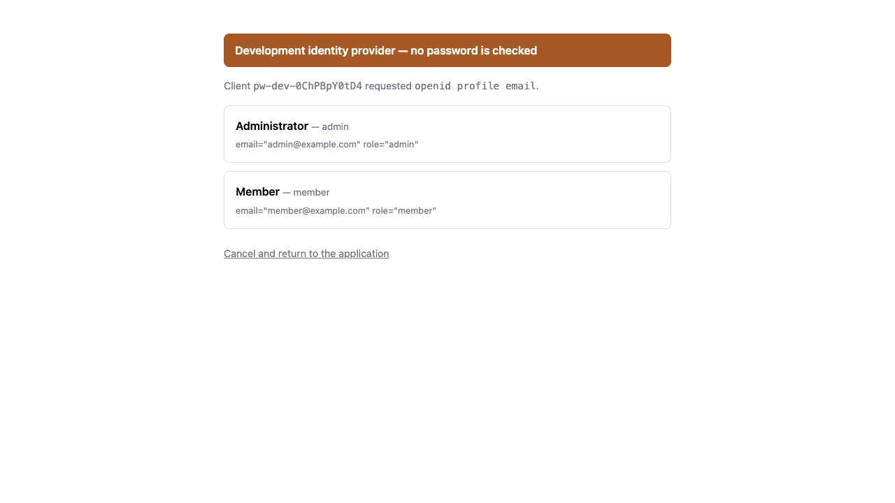

[`pw dev`](/ja/pw/project/dev/) はローカルの OpenID Provider を起動できます。本物の IdP を用意する前から
OIDC ログインを試せます。ログインは一覧からユーザーを選ぶだけで、パスワードは
検証しません。だからこそ開発以外では決して動きません。



```toml
[dev.idp]
enabled = true
# config = "devidp.toml"   # ユーザー定義ファイル。プロジェクトからの相対パス
# port = 0                 # 0 なら空いているループバックポートを確保する
```

ユーザー定義ファイルには、選択できるユーザーと付与する claim を書きます。

```toml
[users.admin]
display_name = "Administrator"
extra_scopes = ["admin"]
[users.admin.claims]
email = "admin@example.com"
role = "admin"

[users.guest]
display_name = "Guest User"
[users.guest.claims]
email = "guest@example.com"
```

クライアント登録も issuer URL のコピーも不要です。`pw dev` が実行ごとに一時的な
クライアントを作り、アプリケーションには

- `AUTH_OIDC_ISSUER`
- `AUTH_OIDC_CLIENT_ID`
- `AUTH_OIDC_CLIENT_SECRET`

を環境変数として渡します。環境変数は TOML より優先されるため、プロバイダの資格情報を
コミットする設定ファイルに入れる必要はありません。自分で export した値は維持され、
生成されるクライアントシークレットは実行ごとに変わり、出力には現れません。

ユーザー定義ファイルを編集すると、その場でリロードされます。issuer と、動作中の
アプリケーションが既に持っている資格情報はそのまま有効なので、再起動は不要です。

このプロバイダが実装するのは、S256 PKCE必須のAuthorization Code Flow、RFC 8628の
Device Authorization、discovery、JWKS、RS256のID Token、UserInfo、RP-Initiated Logoutです。
device専用の公開clientは、client secretを組み込まずに同じユーザー定義ファイルへ追加できます。

```toml
[clients.sensor]
grants = ["device_code"]
valid_scopes = ["telemetry"]
```

deviceはuser codeとverification URIを受け取り、開発者がブラウザで要求を許可または拒否して
ユーザーを選ぶまでpollします。リフレッシュトークン、Client Credentials Grant、同意画面は
意図的にありません。Client Credentialsはend-userを伴わずclient自身として動く用途であり、
Device Authorizationの代わりにはなりません。これをimportしたアプリケーションは`pw build`が
拒否します。詳細は
[`contrib/devidp`](https://github.com/shibukawa/popcornweb/tree/main/contrib/devidp)
を参照してください。

テストでは `testutil.WithIdentityProvider` が同じプロバイダを起動し、
`WithLoginUser` でログインするユーザーを事前に指定できます。ブラウザ操作なしで
ログインが完結します。[テスト](/ja/productivity/testing/)を参照してください。
