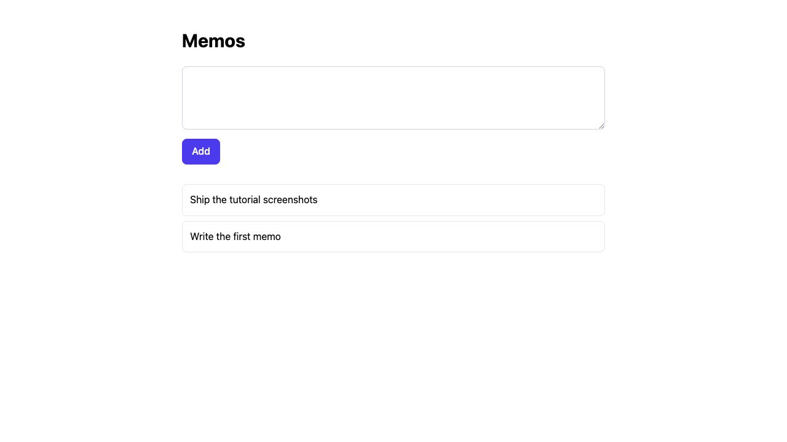

1章で残ったのは、挨拶を返し、保存のたびにリロードするプロジェクトでした。
クエリパラメータを読むのと、人が入力したものを受け取るのとは別の話です。
人は何も書かずに送信ボタンを押しますし、200行を貼り付けることもあります。

この章でフォームを足します。メモの置き場所はいったんメモリの上です。テーブルに移すのは
3章なので、変更は3ファイル、20分ほどで終わります。

:::note[ここから始めるには]
1章の続きです。`pw init memoapp` を実行し、`handlers/home.pw.html` が雛形の
`Home(name: string, project: string)` に戻っている状態。1章を飛ばした場合、`pw init memoapp` を
実行すればちょうどその状態になります。
:::

## 0. Tailwind を足す

1章で断った Tailwind を、ここで入れます。

```sh
pw add tailwind
```

ウィザードが開き、書き込む前に「何を作り、何に追記するか」を並べた確認画面が出ます。
`pw add` にはフラグで飛ばす方法がありません。これから触るのは、すでに動いている
プロジェクトのファイルだからです。承認すると、ツールチェーンのピン留め、
`assets/app.css`、CSS のビルド手順が入ります。

初期化で断った機能が後からそのまま入る、というのはこういうことです。3章はデータベースを、
4章はログインを、同じやり方で足します。

## 1. フォームのあるページ

ページの仕事が2つになりました。書かれたものを並べることと、次の1件を書く箱を出すこと。
`handlers/home.pw.html` を置き換えます。

```html
// handlers/home.pw.html
package handlers

type Memo {
  id: int
  body: string
}

export component Home(memos: Memo[]): html {
  <h1 class="text-3xl font-bold">Memos</h1>
  <form method="post" action="/memos" class="mt-6 space-y-2">
    <textarea name="body" rows="3" required maxlength="200"
      class="w-full rounded-lg border border-slate-300 p-3 focus:border-indigo-500 focus:outline-none"></textarea>
    <button type="submit"
      class="rounded-lg bg-indigo-600 px-4 py-2 font-medium text-white hover:bg-indigo-500">Add</button>
  </form>
  <ul class="mt-8 space-y-2">
  {for memo in memos}
    <li class="rounded-lg border border-slate-200 p-3">{memo.body}</li>
  {/for}
  </ul>
}
```

`type Memo` は Go の構造体になる複合型の宣言です。テンプレートが描画する行と
ハンドラが組み立てる行が1つの型になるので、2つの型を足並みそろえて保守する必要が
ありません。`Memo[]` はそのスライスです。

`required` と `maxlength="200"` は、フォーム自身が受け付ける条件の宣言です。
このあと書く `createMemoInput` の `check` 規則と同じ内容を、ブラウザにも言わせています。
空のまま、あるいは200文字を超えて送信ボタンを押しても、リクエストは飛びません。

これはサーバー側の検証を置き換えるものではありません。**フォームは利便性で、
ハンドラが境界です。**両方書くのは重複ではなく、効く相手が違います。4節でその違いを
実際に見ます。

## 2. 置き場所

メモはリクエストをまたいで残る必要があります。1章ぶんならミューテックス付きの
スライスで足ります。

```go
// handlers/memos.go
package handlers

import "sync"

// memos はメモリ上のリスト。3章でテーブルに置き換わる。
var memos = &store{}

type store struct {
	mu     sync.Mutex
	nextID int
	items  []Memo
}

func (s *store) list() []Memo {
	s.mu.Lock()
	defer s.mu.Unlock()
	return append([]Memo(nil), s.items...)
}

func (s *store) add(body string) {
	s.mu.Lock()
	defer s.mu.Unlock()
	s.nextID++
	s.items = append([]Memo{{Id: s.nextID, Body: body}}, s.items...)
}
```

ここでの `Memo` はテンプレートが宣言した型です。表示用の型と保存用の型の変換が
どこにもないのは、この規模では型が1つしかないからです。2つ目の型と、それに伴う変換は
3章で出てきます。

## 3. ルートを2つ

```go
// handlers/home_handler.go
package handlers

import (
	"net/http"

	"github.com/shibukawa/popcornwave/pw"
)

func init() {
	mux.HandleFunc("GET /{$}", home)
	mux.HandleFunc("POST /memos", createMemo) // 追加
}

// 変更: 雛形の home は homeInput を pw.Parse で読んでいた。
// 読むものが無くなったので、その型ごと消える。

// home lists every memo that has been written.
func home(w http.ResponseWriter, r *http.Request) {
	pw.WriteHTML(w, r, Home(HomeParams{Memos: memos.list()}))
}

// ここから下は雛形に無い。すべて追加。

// createMemoInput is the submitted form.
type createMemoInput struct {
	// Body is the memo text. It is required and capped at 200 characters.
	Body string `payload:"body" check:"required,maxlen=200"`
}

// createMemo stores one memo and redirects back to the list.
//
// A rejected submission comes back as the same page with the message beside
// the field, not as a problem document.
func createMemo(w http.ResponseWriter, r *http.Request) {
	input, err := pw.Parse[createMemoInput](r)
	if err != nil {
		pw.WriteProblem(w, r, err)
		return
	}
	memos.add(input.Body)
	http.Redirect(w, r, "/", http.StatusSeeOther)
}
```

`GET /{$}` は雛形のままです。Go の mux で `GET /` と書くと、より具体的なパターンが
拾わなかったすべてのパスにマッチしてしまいます。`{$}` を付けるとルートだけにマッチするので、
URL を打ち間違えたらメモ一覧ではなく 404 が返ります。

`payload:"body"` はクエリ文字列ではなくリクエストボディを読みます。フォームは
`application/x-www-form-urlencoded` で送りますが、同じ宣言のまま API クライアントからの
JSON ボディも受け取れます。分岐は増えません。`check` の規則は生成時にコンパイルされるので、
`required` も `maxlen=200` もリクエスト時のリフレクションを必要としません。
規則の一覧は[ハンドラ](/ja/guides/frontend/handlers/#バリデーション)にあります。

リダイレクトは `303 See Other` で、見た目より重要です。POST にページを返すと、
ブラウザは再送信できるリクエストを抱えたままになります。リロードすればメモは2件になります。
`GET /` へのリダイレクトを返せば、リロードは一覧を読み直すだけです。

保存してください。`pw dev` が再生成、リビルド、再起動します。箱に何か書いて **Add** を
押せば、一覧に出ます。



## 4. 弾かれたとき

箱を空にしたまま **Add** を押してください。**何も起きません。**ブラウザが送信を止め、
箱の下に「このフィールドを入力してください」と出します。`required` を書いたからです。
200文字を超えて貼り付ければ、ブラウザは201文字目を受け付けません。

これで終わり、ではありません。フォームが止めているのはフォームからの送信だけです。
ブラウザを介さずに同じルートを叩いてみてください。

```sh
curl -i -X POST http://localhost:8080/memos \
  -H 'Content-Type: application/x-www-form-urlencoded' \
  --data 'body='
```

```json
{
  "code": "validation_failed",
  "detail": "Validation failed",
  "errors": [{ "field": "body", "location": "payload", "message": "required" }],
  "status": 400,
  "title": "Validation failed",
  "type": "about:blank"
}
```

`check:"required"` が効いています。RFC 9457 の Problem Details、ステータス 400、
問題のあるフィールドの名前。**フォームの `required` を消してもこの応答は変わりません。**
どちらか一方でよかったのではなく、止めている相手が違います。フォームは人の
打ち間違いを、`check` はリクエストそのものを見ています。

もう一度、今度はブラウザのふりをして同じことをします。

```sh
curl -i -X POST http://localhost:8080/memos \
  -H 'Accept: text/html' \
  -H 'Content-Type: application/x-www-form-urlencoded' \
  --data 'body='
```

```
HTTP/1.1 400 Bad Request
Content-Type: text/html; charset=utf-8
Vary: Accept
```

同じ失敗が、今度は HTML で返ってきます。`pw.WriteProblem` は `Accept` を見て表現を
選びます。ページを欲しがるクライアントには `templates/400.pw.html`、それ以外には
Problem Details。ハンドラには分岐が1つもないことに注意してください。1つのルートが
ブラウザと API クライアントの両方に答えるのに、そのために書くコードはありません。

返ってきたページは `templates/400.pw.html` で、`pw init` が置いていったものです。
中身を見ると、ステータス・タイトル・詳細・フィールドの一覧をパラメータで受け取って
います。誰がそれを埋めるかは環境が決めます。

- `dev`: 問題が持っているものを全部。原因を作ったのは目の前の開発者で、これから直すからです
- それ以外: ステータスとタイトルと request id だけ。同じページが公開先で出るとき、
  何が起きたかは言い、なぜ起きたかは言いません

テンプレートは1つで、切り替わるのは渡される中身の方です。`APP_ENV=prod` で起動し直して
同じ curl を投げれば、詳細が消えたページが返ります。

:::note[書いた godoc がどこに出るか]
`pw dev` を動かしたまま <http://localhost:8080/docs> を開いてください。この章で足した
2つのルートが並んでいます。`POST /memos` の要約は `createMemo` の godoc の1文目、
説明はその続き、`body` パラメータの説明は `createMemoInput` のフィールドコメントです。

`pw generate` がこれらを OpenAPI 文書に書き写しています。godoc を書かなければ、
このページはパスと型だけを並べます。動くものは同じですが、他人がこの API を
読めるかどうかが変わります。書き足して保存すれば、その場で反映されます。

この参照 UI は `config.dev.toml` の `server.api_doc` が出しています。本番の設定
ファイルからこのキーを外せば、文書は生成されたまま公開はされません。
:::

## ここまでで手元にあるもの

- POST するフォーム、それを受けるルート、リロードに耐えるリダイレクト。
- 2箇所のバリデーション。フォームが人の打ち間違いを止め、`check` の規則がリクエストを止めます。
- 1つの失敗に対する2通りの表現。`Accept` を見てフレームワークが選ぶので、ハンドラに分岐はありません。

一覧は再起動のたびに消えたままです。3章でテーブルを与えます。

- [3. メモを保存する](/ja/tutorial/database/) — 次の章。
- [ハンドラ](/ja/guides/frontend/handlers/) — 取得元タグと check 規則の全体。
- [レスポンス](/ja/guides/frontend/responses/) — 問題詳細、JSON、フラグメント。
