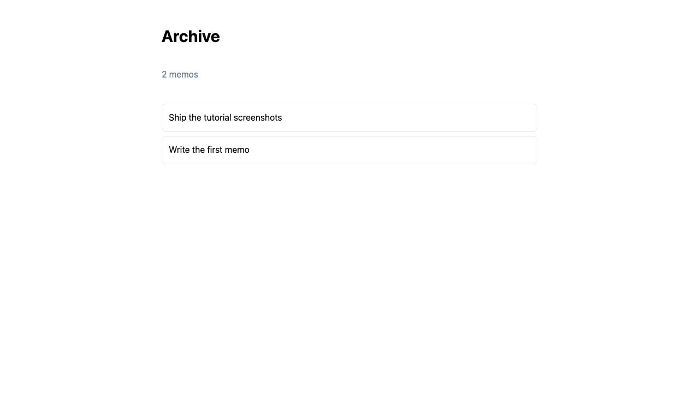

4 章を終えた `memoapp` は、一般的なサーバーレンダリングのアプリケーションです。
次に追加するルートでは、描画済みの文字列だけでは扱えない 3 つの機能を使います。
ページ遷移時に一部だけを更新する、レスポンス開始後に遅い部分を描画する、ページを
開いている間も更新を続ける、という機能です。

探索型のページツリーにディレクトリを作ってルートを追加し、同じページに 3 つの
レンダリング方式を順に適用します。通常のリクエストとレスポンスだけで足りる
アプリケーションなら、これまで使ってきた登録型ルーターのままでも構いません。

25分ほど。コードを多く触るのは最初の節だけです。

:::note[ここから始めます]
第4章の状態から。`author` 列を持つメモのテーブル、`ListMemos` と `CreateMemo` を持つ
`queries/memos.pw.sql`、開発用 IdP を通したログイン、そして `GET /{$}` と `POST /memos` を
提供する `handlers/home_handler.go`。
:::

## 1. ルーターを入れる

```sh
pw add discovered
```

ウィザードの質問は1つで、確認画面が書き込む対象を並べます。`pages/layout.pw.html`、
`pages/page.pw.html`、そしてそれらを読ませる `generate.pages` の項目です。

これまで作ったものは何も消えません。2つのルーターは1つの mux を共有します。メモの
フォームは登録型の `POST /memos` のままで、これから書くページはファイルシステムが
記述する `GET` です。これは移行の途中ではなく、サポートされた形です。

コマンドのあと `pages/page.pw.html` は削除してください。これは `GET /{$}` を提供しますが、
そのパターンはすでにホームハンドラが持っています。同じパターンを2回登録すると標準ライブラリが
起動時に panic します。`pages/layout.pw.html` は残します。

## 2. ディレクトリがルートになる

ファイルを 1 つだけ置いたディレクトリを作ります。

```html
// pages/about/page.pw.html
package about

export component Page(): html {
  <h1 class="text-3xl font-bold">About memoapp</h1>
  <p class="mt-4 text-slate-600">Popcorn Web のチュートリアルに沿って作ったメモアプリケーション。</p>
}
```

`pw dev` を動かして `/about` を開いてください。これでルートは全部です。登録も、ハンドラも、
Go のコードも 1 行もありません。`pw generate` が `pages/` を歩き、ページテンプレートを持つ
ディレクトリを見つけ、登録を `pages/routes_pw_gen.go` に書きました。

ディレクトリの名前を変えれば URL も変わります。ファイルシステムが正本であって、ずれていく
写しではないからです。パッケージ名もディレクトリに従います。Go のほかの場所とまったく同じです。

## 3. データベースが要るページ

About ページには調べるものがありません。メモの一覧にはあります。そこがページが 1 ファイルで
なくなる地点です。

`pages/archive/page.pw.html` を作ります。

```html
// pages/archive/page.pw.html
package archive

type Memo {
  id: int
  body: string
}

export component Page(memos: Memo[]): html {
  <h1 class="text-3xl font-bold">Archive</h1>
  <ul class="mt-8 space-y-2">
  {for memo in memos}
    <li class="rounded-lg border border-slate-200 p-3">{memo.body}</li>
  {/for}
  </ul>
}
```

`type Memo` を `handlers` から import せずここで宣言し直しているのは、テンプレートの
パッケージがそれぞれ自分の型をコンパイルするからで、これは第2章で書いた形と同じです。

次に、その隣の Go です。ページには、サインインしたアカウントとデータベースのプールが要ります。
どちらもリクエストのコンテキストにあります。

```go
// pages/archive/page.go
package archive

import (
	"net/http"

	"memoapp/queries"

	"github.com/shibukawa/popcornweb/pw"
	"github.com/shibukawa/popcornweb/plugin/auth"
)

// Load はこのページの入口。Page という名前にするとコンパイルが通りません。
// テンプレートコンパイラが Page 関数をこのパッケージにすでに出力しています。
func Load(w http.ResponseWriter, r *http.Request) {
	user, ok := auth.User(r.Context())
	if !ok {
		http.Redirect(w, r, "/auth/login", http.StatusSeeOther)
		return
	}
	var list []Memo
	for row, err := range queries.ListMemos(r.Context(), user.AccountID) {
		if err != nil {
			pw.WriteProblem(w, r, err)
			return
		}
		list = append(list, Memo{Id: row.Id, Body: row.Body})
	}
	pw.WriteHTML(w, r, Page(PageParams{Memos: list}))
}
```

サインインした状態で `/archive` を開くと一覧が出ます。ルートは 2 つになりました。片方は
1 ファイル、もう片方はファイルとハンドラ。どちらも自分では登録していません。

### この `Load` がリクエストを取る理由

データを取るページの多くは `Load` を書きません。ローダを `external` として宣言して
テンプレートで束縛するので、呼び出しはページ自身のソースに現れ、ハンドラは生成された
ままです。

```html
external LoadMemos(): Memo[]

export component Page(): html {
{val memos = LoadMemos()}
…
}
```

このシグネチャでは、リクエストやコンテキストを受け取れません。ここでは `auth.User` と
データベースの接続プールが必要で、どちらもリクエストコンテキストから取得します。そのため、
もう一方の形式を使います。`func Load(w, r)` ではルート登録だけが生成され、レスポンスは
ハンドラ側で組み立てます。

段は2つで、シグネチャが選びます。`func(w, r)` でない `Load` は、いま持っている形と
そうあるべき形を挙げて生成が止まります。

### 下にあるものすべてに1つのレイアウト

`pages/layout.pw.html` はすでにあります。その下のページすべてを包みます。

```html
// pages/layout.pw.html
package pages

export component Layout(children: html): html {
  <div class="mx-auto max-w-2xl p-8"><slot required /></div>
}
```

レイアウトは `children: html` を宣言しなければなりません。生成されたチェインが呼ぶ
ラッパーを、コンパイラはその形にだけ出力するからです。ただし最も外側の枠ではありません。
doctype と `<head>` は `templates/document.pw.html` が持ったままで、それがレイアウトの
チェインを外側から包みます。

このレイアウトの連鎖が、部分更新で再利用する範囲を決めます。

## 4. 部分更新: レイアウトはもうそこにあった

ホームからアーカイブへのリンクと、戻るリンクを足します。

```html
// handlers/home.pw.html — Home コンポーネントの中、フォームの上
<a href="/archive" class="text-indigo-600 underline">Archive</a>
```

クリックするとブラウザは `/archive` を取りに行き、すでに持っていた document shell と
レイアウトを捨て、全部を描き直します。2つのページはその外枠を共有していて、どちらも
変わっていないのに、です。

それを止めます。これはプロジェクトの設定ではなく実行時の設定なので、置き場所は
`config.dev.toml` です。`pw init` が `enabled = false` とコメントアウトした鍵の形で
すでに書いています。

```toml
# config.dev.toml
[html.update]
enabled = true
validator_key = "${HTML_UPDATE_VALIDATOR_KEY}"
```

```sh
export HTML_UPDATE_VALIDATOR_KEY=$(openssl rand -base64 32)
```

この環境変数は `pw dev` の前にも `pw migrate` の前にも必要です。設定されていない環境変数を
参照する設定ファイルは読み込みに失敗し、どちらのコマンドもこのファイルを読むからです。

同じ URL は、完全な文書を求めるものには完全な文書を返し続けます。初回訪問、リロード、
クローラー、`curl`。すでにレイアウトを持っているページに対してだけ、実際にマークアップが
変わった境界を返します。

見てください。ページの上には見るものが何もないからです。ブラウザのネットワークパネルを
開いて Archive のリンクを押します。`/archive` へのリクエストに `Pw-Render` と
`Pw-Manifest` が付いていて、後者がそのページのすでに持っている中身です。返ってくるのは
文書ではなく、数百バイト単位の差し替え指示です。同じ URL を `F5` でリロードすれば
完全な文書に戻ります。リロードには、説明すべきページが無いからです。

主張のもう半分は、コマンド1つで済みます。

```sh
curl -s http://localhost:8080/about | head -5
```

doctype、`<head>`、レイアウト、ページ。何も削られていません。更新ヘッダを送らない
クライアントは劣化したクライアントではなく、ブラウザがそう言うまでどの応答もたどる
経路がそれです。

`Load` は変えていません。テンプレートも変えていません。描画されたチェインのレイアウトと
ページはどれも最初から境界なので、再利用のために書いたレイアウトのチェインが、そのまま
部分更新の欲しい形になっていた、というだけです。

鍵は飾りではありません。境界は自分が描画したバイトのダイジェストで識別され、エントロピーの
低い内容の鍵なしダイジェストは推測で確認できてしまいます。だから起動時に、鍵のない
`enabled = true` は提供されるのではなく拒否されます。

普通のコンポーネント呼び出しは境界になりません。これは意図的で、そうでなければ500行の
リストが毎リクエストに500個の項目を載せることになります。レイアウトでない領域を境界に
したくなったときの話は[部分更新](/ja/guides/cross-layer/partial-updates/)にあります。

## 5. 非同期: データが届く前に描画する

アーカイブのページは、1バイトも送る前に `ListMemos` を待ちます。メモが100件なら誰も
気づきません。1年分のレポートなら、読者は空のタブを眺めることになります。

非同期描画はその結合を切ります。引数に `async` を付け、`await` ブロックの中で読みます。

```html
// pages/archive/page.pw.html
package archive

type Memo {
  id: int
  body: string
}

// changed: memos は完成した値ではなく、保留中の値になった。
export component Page(memos: async Memo[]): html {
  <h1 class="text-3xl font-bold">Archive</h1>
  {await list = memos}
    <ul class="mt-8 space-y-2">
    {for memo in list}
      <li class="rounded-lg border border-slate-200 p-3">{memo.body}</li>
    {/for}
    </ul>
  {fallback}
    <p class="mt-8 text-slate-500">メモを読み込んでいます…</p>
  {/await}
}
```

`Load` はスライスの代わりにハンドルを渡します。

```go
// pages/archive/page.go — Load の末尾。ループと WriteHTML を置き換える
	pw.WriteHTML(w, r, Page(PageParams{
		// new: ここで自分の goroutine の中で処理が始まり、描画はそれを待たずに進む。
		Memos: pw.Go(r.Context(), func(ctx context.Context) ([]Memo, error) {
			var list []Memo
			for row, err := range queries.ListMemos(ctx, user.AccountID) {
				if err != nil {
					return nil, err
				}
				list = append(list, Memo{Id: row.Id, Body: row.Body})
			}
			return list, nil
		}),
	}))
```

import に `"context"` を足し、`WriteHTML` の前にあったループは消します。

ストリーミングの API を呼ぶことも、ヘッダを立てることも、flush を仕込むこともありません。
`pw.WriteHTML` は組み上がった文書に await 境界があるかを尋ね、自分で経路を選びます。
境界のないページは今までどおりのバッファされたレスポンスのままです。レスポンスが
ストリームされるかどうかはテンプレートの性質であって、ハンドラごとに繰り返す判断ではありません。

`fallback` は必須で、そこがこの設計の正直なところです。値が存在する前に境界は何かを
描画しなければならず、フレームワークがそれを勝手に決めることはしません。

`/archive` をリロードしても、その fallback はまず見えません。SQLite から4行取るのは
ブラウザが描くより速いからです。遅い場合を一瞬だけ本物にしてみてください。`pw.Go` の
クロージャの先頭に `time.Sleep(2 * time.Second)` を置き、`"time"` を import して
リロードします。

見出しはすぐ出ます。その下に **Loading memos…**。2秒後、リストがそれを置き換えます。
ネットワークパネルに2本目のリクエストは出ません。1本目がまだ開いたままだからです。
1つの応答が分割して届き、最初の一片が役に立った、ということです。

2秒は `html.async_timeout` の内側で、既定は3秒です。それを超えた境界が応答を
止めてしまうわけではありません。何が起きるかは
[非同期描画](/ja/guides/cross-layer/async-rendering/)にあります。

Sleep は戻してください。仕組みを見るための手段であって、置いたままにすると、
このページのリロードが以後ずっと何も示さない実演になります。

## 6. ライブ: 届き続ける領域

非同期は一度で確定します。通知の数、キューの深さ、チャットのログはその逆を求めます。
サーバーが新しいことを知ったとき、いま見られているページがそれを言うべきだ、という話です。

ライブのソースを宣言し、同じ `await` 節に束縛します。

```html
// pages/archive/page.pw.html — コンポーネントの上
external live MemoCount(): int
```

```html
// pages/archive/page.pw.html — Page の中、h1 の下
{await total = MemoCount()}
  <p class="text-slate-500">{total} 件</p>
{fallback}
  <p class="text-slate-500">数えています…</p>
{/await}
```

`{live}` 節はありません。値がどのくらいの頻度で届くかを言ったのは待ち受け側ではなく、
宣言のほうだからです。`async` から `live` に変わったソースは、それを呼ぶテンプレートを
1つも変えません。

Go の側は、終わらないシーケンスです。

```go
// pages/archive/live.go
package archive

import (
	"context"
	"iter"
	"time"

	"memoapp/queries"

	"github.com/shibukawa/popcornweb/plugin/auth"
)

// MemoCount はこのアカウントのメモ数を、5秒ごとに繰り返し報告する。
//
// ライブのソースにコンテキストは必須。終わらないシーケンスには、それ以外に
// 戻る理由がなく、購読より長生きする goroutine は上限のないリークになる。
// これはリクエストのコンテキストでもある。購読はページ自身のルートで応答されるので、
// 最初の描画でセッションを解決したミドルウェアが、これにも同じことをしている。
func MemoCount(ctx context.Context) iter.Seq2[int, error] {
	return func(yield func(int, error) bool) {
		user, ok := auth.User(ctx)
		if !ok {
			return
		}
		ticker := time.NewTicker(5 * time.Second)
		defer ticker.Stop()
		for {
			select {
			case <-ctx.Done():
				return
			case <-ticker.C:
				count := 0
				failed := false
				for _, err := range queries.ListMemos(ctx, user.AccountID) {
					if err != nil {
						// yield したエラーは配信であって終端ではない。境界は
						// recover の部分木を出し、次の正常な値がそれを本来の
						// 内容に戻す。
						if !yield(0, err) {
							return
						}
						failed = true
						break
					}
					count++
				}
				if failed {
					continue
				}
				if !yield(count, nil) {
					return
				}
			}
		}
	}
}
```

全行を読んで数えるのは、クエリとしては間違っていて、例としては正しい。第3章がすでに
与えたものだけで書けているからです。本物は `ListMemos` の隣に置く `count(*)` の
ステートメントです。

`/archive` を2つのタブで開き、片方でメモを足して、もう片方の数字が5秒以内に動くのを
見てください。`Load` もレイアウトも、これが起きていることを知りません。ライブのソースは
生成されたコードが購読のコンテキストとともに呼ぶので、組み立てるハンドルも `Params` に
通すものもありません。



手を出す前に知っておく価値のある代償が1つ。配信は境界の部分木を丸ごと置き換えるので、
長いリストを包んだライブ領域は毎回そのリストの長さを払います。実際に変わる部分の周りに
境界を置いてください。上の件数を、リストに畳み込まずに独立した `await` ブロックにして
あるのはそのためです。

そしてこれは、読者1人につき接続が1本開く唯一のモデルです。それを守る境界と、5秒間隔の
ポーリングのほうが良い場面は[ライブ描画](/ja/guides/cross-layer/live-rendering/)にあります。

## 5章かけて作ったもの

最初の描画のあとにページが変わる3つの方法と、それぞれが存在する理由。

- **部分更新**は何の代償もありません。再利用のために書くレイアウトのチェインが、
  そのまま差分の欲しい形だからです。
- **非同期**は `fallback` と `pw.Go` を代償に、いちばん遅いクエリが答える前に
  使えるようになるページを買います。
- **ライブ**は接続1本と境界の抑制を代償に、読者が何もしなくても正しいままのページを買います。

3つは組み合わせられます。1つの `await` 節が確定する束縛とライブの束縛を同時に持てますし、
3つとも使うページは普通のページです。

そしてどれも、クライアント側のフレームワークではありません。読者が受け取ったのは最初の
バイトから最後のバイトまでサーバーが描画した HTML で、関わったブラウザのコードは、
出来上がったマークアップを所定の位置へ移す小さなモジュール1つだけです。

- [探索型ルーティング](/ja/guides/cross-layer/discovered-routing/) — アクション、
  動的セグメント、そしてページという形がどこで終わるか。
- [非同期描画](/ja/guides/cross-layer/async-rendering/) — 3つの節と、境界の待ち時間を
  何が縛るか。
- [テスト](/ja/productivity/testing/) — ハンドラのテスト。ログインの全工程を1リクエストで
  済ませるヘルパーもあります。
- [pw build](/ja/pw/project/build/) — デプロイするバイナリを作る。
