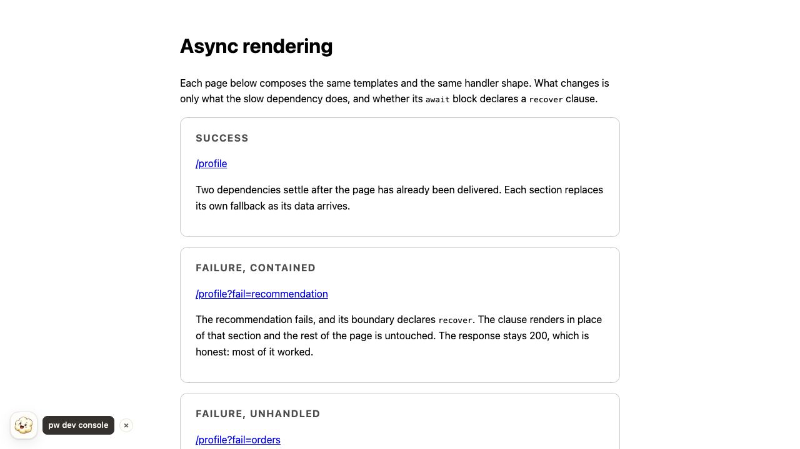
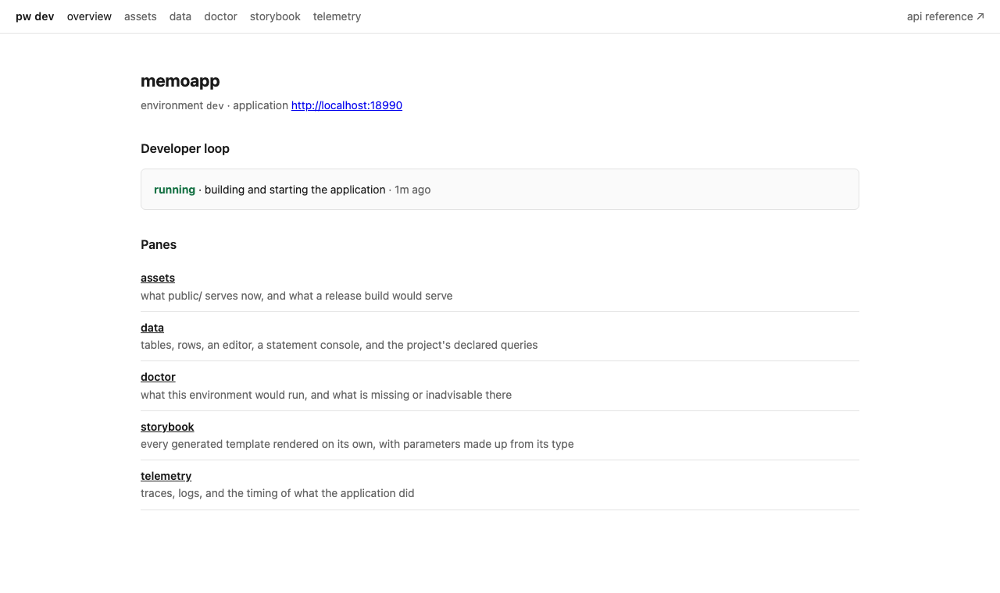
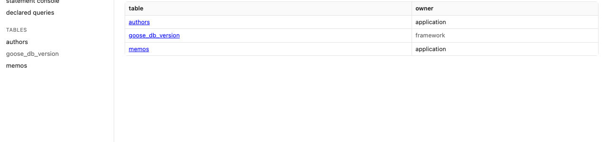
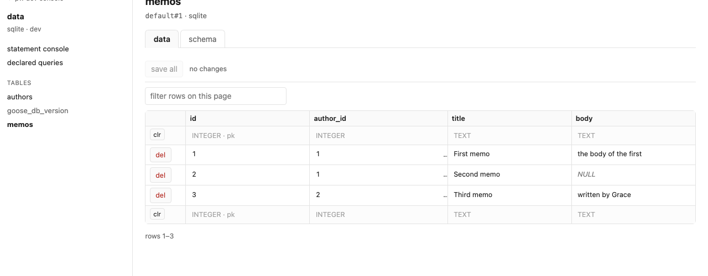
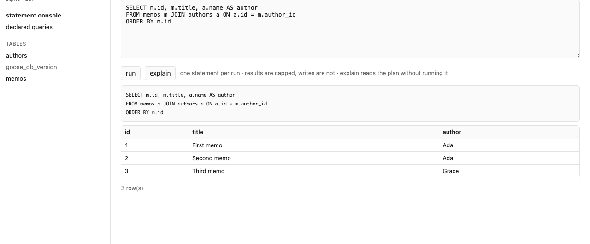
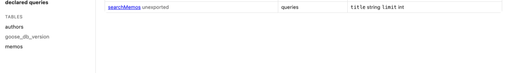
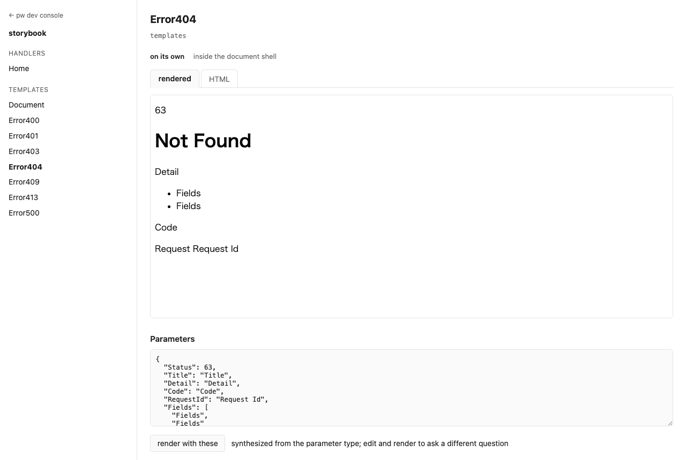
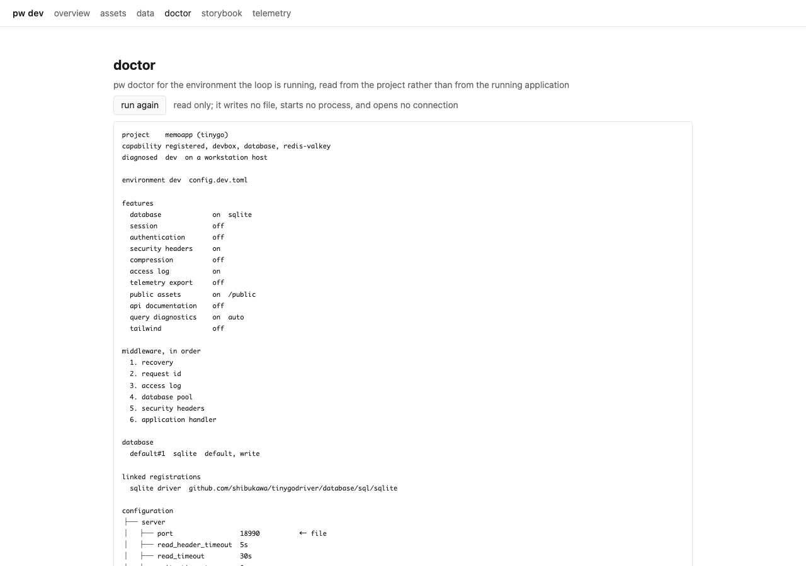
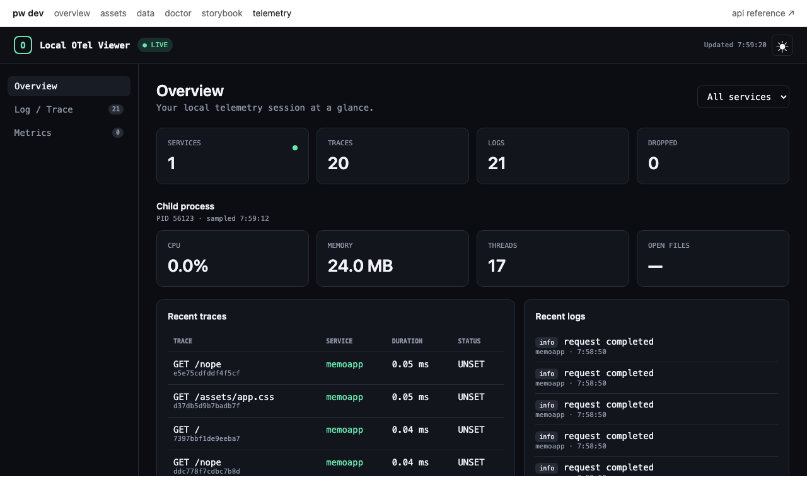

A development loop asks a lot of small questions. Which migration is applied?
What is actually in that table? Does this statement return what the handler
expects? What does the error page look like at 404? Is that asset being served
from where I think it is?

Each one has a tool. Between them they are four applications, three of which
need a connection string pasted in and one of which cannot reach a SQLite file
opened by another process at all.

[`pw dev`](/pw/project/dev/) prints one more address at startup:

```
pw dev: console http://127.0.0.1:18081
```



Everything below is on that page, pointed at the project already running.
Nothing was configured to make it so.



## What it holds

The overview is the loop itself — the phase it is in, when it last changed, and
the diagnostic if it failed. The link to the application opens in a tab of its
own. The panes are listed with what each is for, and a pane the project switched
off says which setting turns it back on rather than disappearing.

The navigation is the same on every pane, and it stays at the top of the window
while the pane scrolls under it. The API reference sits at its right, as an
external link, because that page is the application's own and is served at
whatever path the runtime configuration names.

## Data

The data pane is a table browser for the database the application opened, on the
connection the application opened it with. That last part is the reason it is
here rather than in a separate tool: a SQLite database is a file held by one
process, and `:memory:` is not a file at all. Neither is reachable from outside
the application. So the pane runs inside it.



The header says which connection, which engine, and what version the schema is
at. Tables the framework owns — `goose_db_version` and its kin — are marked, so
a project's own tables are the ones that stand out.

A table opens on its data, with its schema one tab away.



Rows are editable in place. A changed cell turns red and the row's `del` button
becomes `revert`, so the row says what is about to happen to it and the way back
is where the way forward was. Nothing reaches the database until save — either
the row's own save, or *save all* at the top. The blank row at each end of the
table is where an insert is typed; a column left empty takes the default the
schema decided.

Sorting and filtering are local to the page. They never ask the server, which
is what lets them run without losing the edits in progress.

The way back from an editing session is on the overview: **reseed** applies the
project's [seed datasets](/productivity/seed-data/), which is clear-insert, so
the tables they target are emptied and refilled.

## Statements

The statement console runs one statement against that same connection.



Reads are capped; writes are not, because a development database is a place to
try things. **explain** reads the plan without running the statement.

## Declared queries

Every statement in the project's `.pw.sql` sources appears here, with its
parameters.



Running one from this page builds the same statement the application builds —
not a copy of the SQL, the generated builder itself. Unexported statements are
listed too, and are exactly the ones worth trying here: nothing else in the
project can call them yet.

Parameters are typed. A statement taking a type no form field can express is
still listed, so you can see that generation found it, rather than wondering
whether it was missed.

## Templates

The storybook renders every template in the project on its own, with parameters
synthesized from the parameter type.



A story shows either the rendered result or the HTML it produced, pretty-printed.
The parameters below it are editable: change them, render again, and ask the
template a different question. The project's stylesheet is linked into the story,
so a Tailwind-styled template looks the way it will look in the application.

Templates render inside the document shell or on their own, which is the
difference between checking a page and checking a fragment.

Unexported templates are included, for the same reason unexported statements are.
Both registries are generated into the project's own packages, under the `pwdev`
build tag, because a symbol the project does not export is reachable from
nowhere else.

## Doctor

The doctor pane is [`pw doctor`](/pw/project/doctor/) run against the project as
it currently stands, without leaving the browser for a terminal.



## Telemetry

The [telemetry viewer](/productivity/dev-telemetry-viewer/) is the console's
last pane rather than a separate address. Requests are named by method and path,
so a trace list reads as the requests it came from.



## The overlay

Two parts of the console are not on the console. The first shows up when a step
of the loop fails — generation, a migration, the build. The failure is put over
the pages the application serves, so a broken build is visible in the tab
already open rather than only in the terminal behind it. A page whose
application has since been replaced reloads itself.

## The launcher

The second is the way in. The console's address is printed once at startup and
is well out of sight by the time you want it, several rebuilds later, so a small
floating button sits in a corner of every page the application serves and opens
the console index in a tab of its own. Clicking it again returns to that tab
instead of opening another. While the loop is between two working applications
the button carries a ring, which is the only thing on a stale page that says it
is stale.

It is a link and a status and nothing more. There is no request list, no query
count, and no timing panel on the application's own pages: those belong to
[the telemetry viewer](/productivity/dev-telemetry-viewer/), where they outlive
the build that failed.

## Static assets

The assets pane lists what the application serves statically, where each file
comes from, and what it is served as — the answer to a 404 that should have been
a file, and to a file that is being served from somewhere other than where you
edited it.

## What is not here

The console is a development surface and is structurally absent from a release
build. Every part of it — the registries, the panes, the browser code they need
— carries the `pwdev` build tag, so [`pw build`](/pw/project/build/) does not
compile it, does not link it, and cannot serve it. There is no flag that turns
it on in production, because there is nothing there to turn on.

There is no schema editing. Migrations are how a schema changes in this
framework, and a console that could also change it would give a project two
answers to the same question. The pane reports the version the schema is at; the
way to move it is [a migration](/productivity/migrations/).

## Configuration

The console runs by default. Its address is printed at startup, and the panes
that depend on an optional subsystem — telemetry, the database — appear when
that subsystem is configured and say what to configure when it is not.

Each pane has a key of its own, so switching one off is not switching the
console off.

| Setting | Effect |
| --- | --- |
| `dev.console.enabled` | `false` runs the loop with no console |
| `dev.console.port` | the console's port; the default is `18081` |
| `dev.console.assets.enabled` | the static asset pane |
| `dev.console.data.enabled` | the data pane, statement console, and query runner |
| `dev.console.storybook.enabled` | the template storybook |
| `dev.console.overlay.enabled` | the failure overlay on the application's pages |
| `dev.console.overlay.reload` | reload a page whose application was replaced |
| `dev.console.launcher.enabled` | the floating link to the console on those pages |
| `dev.console.launcher.corner` | which corner it takes; the default is `bottom-left` |
| `dev.otel.enabled` | `false` removes the telemetry pane |

The launcher takes the bottom left, because the bottom right is where
applications put their own floating controls. When it is in the way anyway — a
sticky footer, a widget of your own — move it rather than working around it.
`pw init` writes the corner into `popcornwave.toml` so it is there to edit:

```toml
[dev.console.launcher]
corner = "top-right"
```

The four corners are `bottom-left`, `bottom-right`, `top-left` and `top-right`,
and anything else is a configuration error naming them, so a typo is not quietly
read as the default. The loop picks the new corner up on its next restart, which
editing the file already causes.

For the two minutes you spend clicking whatever it happens to sit over, hovering
it reveals a control that hides it until the tab closes. A project that wants it
gone for good sets `dev.console.launcher.enabled` to `false`.

Turning off the overlay and the launcher together is what makes a development
page byte-identical to a production one: with neither attached, nothing is
served for the browser to load. Turning off one leaves the other working, which
is why they are two settings and not one.

The port is fixed rather than reserved, unlike every other development listener
here. A surface you bookmark and come back to all day cannot move on each run.

## See also

- [`pw dev`](/pw/project/dev/) — the loop the console reports on
- [Development Telemetry Viewer](/productivity/dev-telemetry-viewer/)
- [Seed data](/productivity/seed-data/) — what the reseed button applies
- [Migrations](/productivity/migrations/) — how the schema version moves
